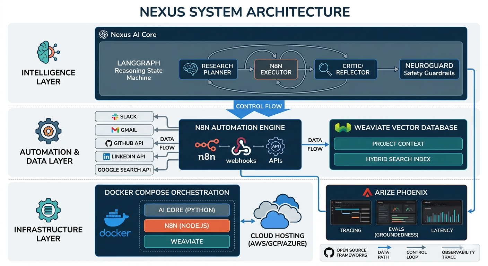

# Nexus

Multi-Agent Research & Automation Engine

Nexus is a Multi-Agent Research & Automation Engine that implements a sophisticated agent workflow using LangGraph for iterative research tasks.



## Architecture Overview

Nexus implements a multi-agent system using LangGraph's StateGraph architecture with three specialized agents working in an iterative loop:

1. **Research Planner**: Breaks down high-level tasks into specific, actionable research steps using GPT-4o
2. **n8n Executor**: Executes research steps via external automation (n8n webhooks) with local fallback simulation
3. **Evaluator**: Assesses whether research data sufficiently addresses the original task using LLM-based evaluation

The workflow uses conditional looping where the evaluator decides whether to continue planning or end based on completion status and iteration thresholds. This creates an intelligent, self-improving research pipeline that adapts based on evaluation feedback.

## Why Use Nexus

- **Automated Research**: Eliminates manual research steps by automating the entire research workflow
- **Iterative Improvement**: Continuously refines research through evaluation feedback loops
- **Flexible Execution**: Supports both external n8n automation and local fallback for research execution
- **Scalable Design**: Modular architecture allows easy addition of new agent types or workflow modifications
- **Production Ready**: Includes proper error handling, timeouts, logging, and environment configuration

## Technology Stack

- **LangGraph**: For implementing the agent workflow and state management
- **GPT-4o**: Language model powering the planner and evaluator agents
- **n8n**: External automation service for executing research steps (with local fallback)
- **Python**: Core implementation language
- **FastAPI**: REST API interface for submitting research tasks
- **Docker**: Containerization for easy deployment
- **React**: Frontend UI for interacting with the system

## Installation

### Prerequisites
- Docker and Docker Compose
- Python 3.8+ (for local development)
- OpenAI API key (for GPT-4o access)
- n8n instance (optional, for external automation)

### Quick Start with Docker

1. Clone the repository:
   ```bash
   git clone https://github.com/yourusername/nexus.git
   cd nexus
   ```

2. Configure environment variables:
   ```bash
   cp .env.example .env
   # Edit .env with your configuration (see example below)
   ```

3. Example .env configuration:
   ```
   OPENAI_API_KEY=sk-your-openai-api-key-here
   N8N_WEBHOOK_URL=http://n8n:5678/webhook/research
   WEAVIATE_URL=http://weaviate:8080
   WEAVIATE_API_KEY=your-weaviate-key-here
   PHOENIX_ENABLED=true
   PHOENIX_ENDPOINT=http://localhost:6006
   LOG_LEVEL=INFO
   ```

4. Start the services:
   ```bash
   docker-compose up --build
   ```

### Local Development

1. Install Python dependencies:
   ```bash
   pip install -r requirements.txt
   ```

2. Set up environment variables:
   ```bash
   cp .env.example .env
   # Edit .env with your configuration (see example below)
   ```

3. Example .env configuration:
   ```
   OPENAI_API_KEY=sk-your-openai-api-key-here
   N8N_WEBHOOK_URL=http://n8n:5678/webhook/research
   WEAVIATE_URL=http://weaviate:8080
   WEAVIATE_API_KEY=your-weaviate-key-here
   PHOENIX_ENABLED=true
   PHOENIX_ENDPOINT=http://localhost:6006
   LOG_LEVEL=INFO
   ```

4. Start the API server:
   ```bash
   uvicorn nexus.main:app --reload
   ```

5. Start the frontend (if applicable):
   ```bash
   cd ui
   npm install
   npm start
   ```

The system will be accessible at http://localhost:8000 for the API and http://localhost:3000 for the frontend (if configured).

## License

This project is licensed under the MIT License - see the LICENSE file for details.