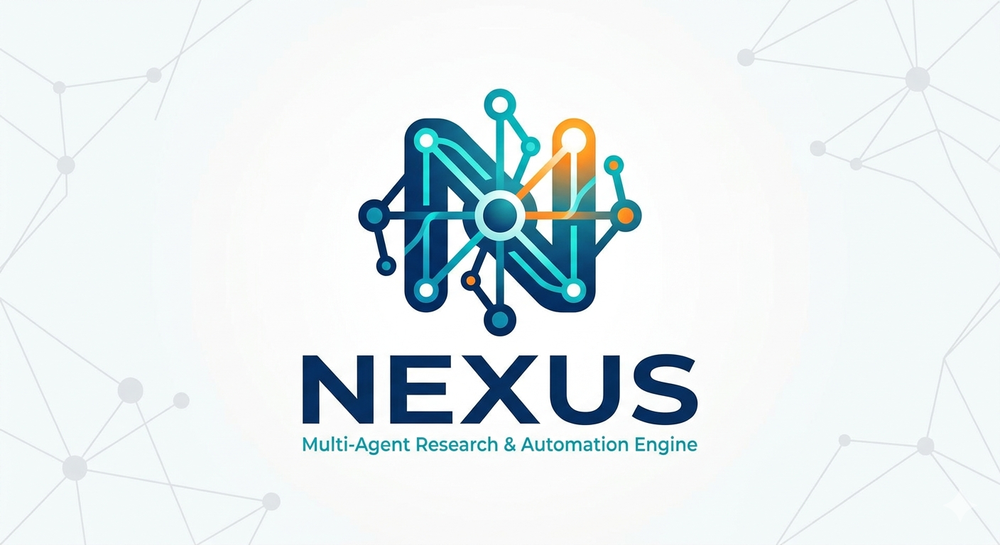
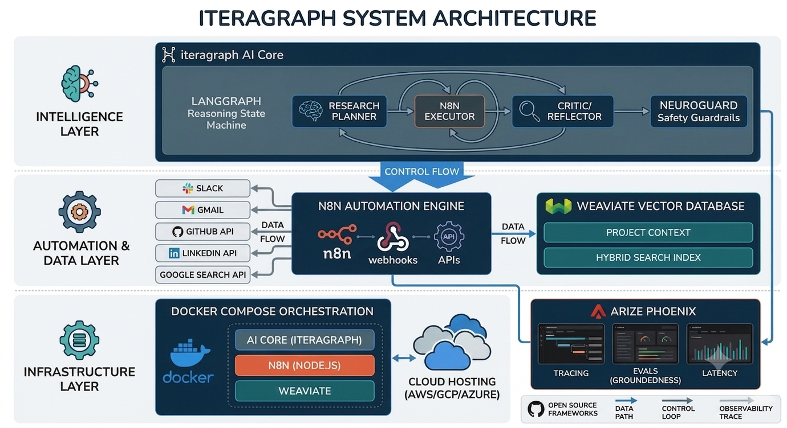
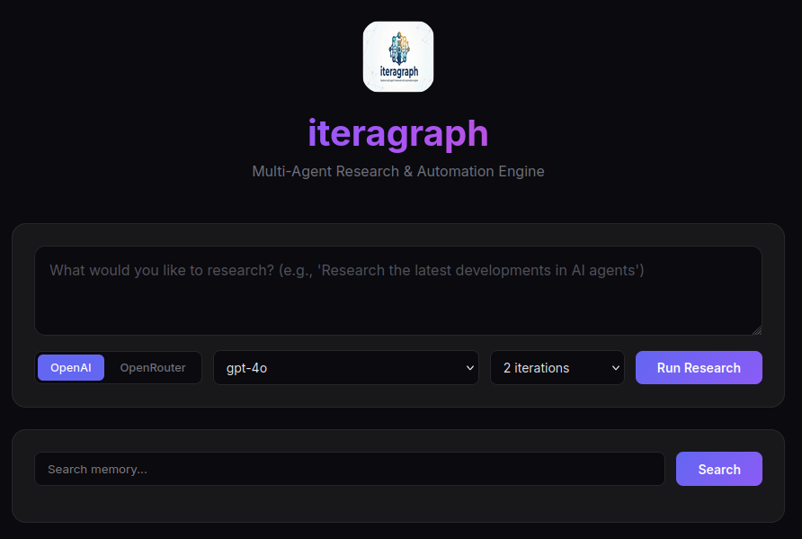

# iteragraph - Multi-Agent Research & Automation Engine


iteragraph is a Multi-Agent Research & Automation Engine that implements a sophisticated agent workflow using LangGraph for iterative research tasks. Supports both OpenAI and OpenRouter (free open models).



## Architecture Overview

iteragraph implements a multi-agent system using LangGraph's StateGraph architecture with three specialized agents working in an iterative loop:

1. **Research Planner**: Breaks down high-level tasks into specific, actionable research steps using GPT-4o (or any OpenRouter model)
2. **n8n Executor**: Executes research steps via external automation (n8n webhooks) with local fallback simulation
3. **Evaluator**: Assesses whether research data sufficiently addresses the original task using LLM-based evaluation

The workflow uses conditional looping where the evaluator decides whether to continue planning or end based on completion status and iteration thresholds. This creates an intelligent, self-improving research pipeline that adapts based on evaluation feedback.

## Why Use iteragraph

- **Automated Research**: Eliminates manual research steps by automating the entire research workflow
- **Iterative Improvement**: Continuously refines research through evaluation feedback loops
- **Flexible Execution**: Supports both external n8n automation and local fallback for research execution
- **Scalable Design**: Modular architecture allows easy addition of new agent types or workflow modifications
- **Production Ready**: Includes proper error handling, timeouts, logging, and environment configuration
- **Open Source**: Free to use, modify, and distribute under MIT License; built with open source technologies

## Technology Stack

iteragraph is built using open source technologies:

- **LangGraph**: For implementing the agent workflow and state management (open source)
- **GPT-4o**: Language model powering the planner and evaluator agents (via OpenAI / OpenRouter)
- **n8n**: External automation service for executing research steps (with local fallback) (open source)
- **Python**: Core implementation language (open source)
- **FastAPI**: REST API interface for submitting research tasks (open source)
- **Docker**: Containerization for easy deployment (open source)
- **React**: Frontend UI for interacting with the system (open source)

## Installation

### Prerequisites
- Docker and Docker Compose
- Python 3.8+ (for local development)
- OpenAI API key or OpenRouter API key (for LLM access)
- n8n instance (optional, for external automation)

### Quick Start with Docker

1. Clone the repository:
    ```bash
    git clone https://github.com/yourusername/iteragraph.git
    cd iteragraph
    ```

2. Configure environment variables:
   ```bash
   cp .env.example .env
   # Edit .env with your configuration (see below)
   ```

3. Example .env configuration:
   ```
   # OpenAI (default for GPT-4o)
   OPENAI_API_KEY=sk-your-openai-api-key-here

   # OpenRouter (for free/open models — optional)
   OPENROUTER_API_KEY=sk-or-v1-your-openrouter-key-here

   N8N_WEBHOOK_URL=http://n8n:5678/webhook/research
   WEAVIATE_URL=http://weaviate:8080
   WEAVIATE_API_KEY=your-weaviate-key-here
   PHOENIX_ENABLED=true
   PHOENIX_ENDPOINT=http://localhost:6006
   LOG_LEVEL=INFO
   ```

4. Start the services:
   ```bash
   docker compose up --build
   ```

   This launches 4 containers:

   | Service | URL | Description |
   |---------|-----|-------------|
   | **iteragraph-api** | http://localhost:8000 | FastAPI research engine |
   | **weaviate** | http://localhost:8080 | Vector database for memory |
   | **n8n** | http://localhost:5678 | Workflow automation |
   | **phoenix** | http://localhost:6006 | Observability & tracing |

   Docker internal hostnames (`n8n`, `weaviate`) are resolved within the `iteragraph-network` bridge network, so no changes to `.env` are needed when running with Docker Compose.

### Local Development

1. Install Python dependencies:
   ```bash
   pip install -r requirements.txt
   ```

2. Set up environment variables:
   ```bash
   cp .env.example .env
   # Edit .env with your configuration (see example below)
   ```

3. Example .env configuration:
   ```
   # OpenAI (default for GPT-4o)
   OPENAI_API_KEY=sk-your-openai-api-key-here

   # OpenRouter (for free/open models — optional)
   OPENROUTER_API_KEY=sk-or-v1-your-openrouter-key-here

   N8N_WEBHOOK_URL=http://localhost:5678/webhook/research
   WEAVIATE_URL=http://localhost:8080
   WEAVIATE_API_KEY=your-weaviate-key-here
   PHOENIX_ENABLED=true
   PHOENIX_ENDPOINT=http://localhost:6006
   LOG_LEVEL=INFO
   ```

4. Start the API server:
    ```bash
    uvicorn iteragraph.api.main:app --reload
    ```

5. Start the frontend dev server:
   ```bash
   cd ui
   npm install
   npm start
   ```

The system will be accessible at:
- **API**: http://localhost:8000
- **UI**: http://localhost:3000 (with live reload)



## License

This project is licensed under the MIT License - see the LICENSE file for details.

## Disclaimer

This project is currently being refined and finalized.
